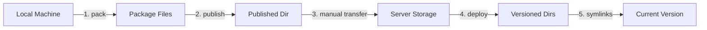

# Deploy Tool

A powerful deployment tool for ML models and algorithms, designed to simplify the packaging, publishing, and deployment of machine learning projects.

## Features

- **Component-based Management**: Separate packaging and publishing for flexible version control
- **Type-agnostic Design**: Define your own component types (model, config, runtime, etc.)
- **Git-driven Workflow**: All configurations and manifests are managed through Git
- **Path Management**: Project-root based path resolution for consistency and portability
- **Multiple Compression Algorithms**: Support for gzip, bzip2, xz, lz4
- **Progress Tracking**: Real-time progress display with Rich library
- **Version Management**: Deploy multiple versions and switch "current" version easily

## Quick Start

### Installation

```bash
# Install from wheel package (internal distribution)
pip install --user deploy_tool-1.0.0-py3-none-any.whl

# Verify installation
deploy-tool --version
# or
python -m deploy_tool --version
```

### Basic Usage

#### 1. Initialize a project

```bash
# Interactive mode - will prompt for project details
deploy-tool init

# Initialize with project name
deploy-tool init --name "My Algorithm Project"
# or use short option
deploy-tool init -n "My Algorithm Project"

# Initialize with all options (skip interactive mode)
deploy-tool init -n "My Project" -t algorithm -d "My awesome ML algorithm"

# Initialize in a new directory
deploy-tool init ./my-new-project

# Force initialization in non-empty directory
deploy-tool init --force
# or
deploy-tool init -f

# Skip git initialization
deploy-tool init --no-git
```

**Available options for `init` command:**
- `-n, --name`: Project name
- `-t, --type`: Project type (choices: `algorithm`, `model`, `service`, `general`, default: `algorithm`)
- `-d, --description`: Project description
- `-f, --force`: Force initialization even if directory is not empty
- `--no-git`: Skip git repository initialization

The initialization process creates:
- `.deploy-tool.yaml` - Project configuration file
- `deployment/` - Directory structure for deployment artifacts
- `.gitignore` - Git ignore rules with sensible defaults
- `src/` - Source code directory (managed by Git)
- `dist/` - Output directory for packaged components (Git ignored)

#### 2. Package components

When you have new model files or configurations to deploy:

```bash
# Auto mode (recommended) - must specify type and version
deploy-tool pack ./models --auto --type model --version 1.0.1

# The tool will:
# 1. Scan the directory structure
# 2. Generate packaging configuration
# 3. Create compressed package in dist/
# 4. Generate manifest file in deployment/manifests/
# 5. Show you what to do next

# Output example:
✓ Scanning directory: ./models
✓ Auto-generated config: deployment/package-configs/model-auto.yaml
✓ Packaging type: model
✓ Package created: dist/model-1.0.1.tar.gz (245.3 MB)
✓ Manifest created: deployment/manifests/model-1.0.1.manifest.json

📝 Next steps:
1. Review the generated config (optional):
   cat deployment/package-configs/model-auto.yaml
   
2. Commit the manifest to Git:
   git add deployment/manifests/model-1.0.1.manifest.json
   git commit -m "Add model version 1.0.1"
   git push

# Package different component types
deploy-tool pack ./configs --auto --type config --version 1.0.0
deploy-tool pack ./runtime --auto --type python-runtime --version 3.10.12
```

**Understanding packaging:**
- The tool creates a compressed archive of your files
- A manifest file records checksums for integrity verification
- The manifest must be committed to Git for version tracking
- The actual package files (in dist/) are not committed to Git

#### 3. Publish components

Publishing prepares your packaged components for deployment:

```bash
# Publish multiple components as a release
deploy-tool publish \
  --component model:1.0.1 \
  --component config:1.0.0 \
  --component python-runtime:3.10.12 \
  --release-version 2024.01.20

# The tool will:
# 1. Verify all components exist and are valid
# 2. Copy packages to deployment/published/
# 3. Generate a release manifest
# 4. Show transfer instructions

# Output example:
✓ Validating components...
✓ Publishing model:1.0.1
✓ Publishing config:1.0.0  
✓ Publishing python-runtime:3.10.12
✓ Release manifest created: deployment/releases/2024.01.20.json

📦 Published to: deployment/published/2024.01.20/
├── model-1.0.1.tar.gz (245.3 MB)
├── config-1.0.0.tar.gz (1.2 MB)
└── python-runtime-3.10.12.tar.gz (487.6 MB)

🚀 Transfer Instructions:
Please transfer the published directory to your deployment server:

  From: deployment/published/2024.01.20/
  To:   <deployment-server>:/storage/releases/2024.01.20/

Example commands:
  rsync -avz deployment/published/2024.01.20/ server:/storage/releases/
  scp -r deployment/published/2024.01.20/ user@server:/storage/releases/

📝 Don't forget to commit the release manifest:
  git add deployment/releases/2024.01.20.json
  git commit -m "Release version 2024.01.20"
  git push
```

**Understanding publishing:**
- Publishing groups multiple components into a release
- In filesystem mode, you manually transfer files
- The release manifest tracks what components are in each release

#### 4. Deploy a release

On your deployment server, after transferring the files:

```bash
# Deploy a specific release version
deploy-tool deploy --release 2024.01.20

# The tool will:
# 1. Read the release manifest from deployment/releases/
# 2. Extract all components to versioned directories
# 3. Set this version as "current" via symlinks
# 4. Show the deployment structure

# Output example:
✓ Reading release manifest: 2024.01.20
✓ Deploying model:1.0.1...
✓ Deploying config:1.0.0...
✓ Deploying python-runtime:3.10.12...
✓ Setting as current version...

📁 Deployment Structure:
/opt/myapp/
├── deployments/                    # All versions stored here
│   ├── model/
│   │   ├── 1.0.0/                 # Previous version (kept)
│   │   └── 1.0.1/                 # Newly deployed
│   ├── config/
│   │   ├── 0.9.0/                 # Previous version (kept)
│   │   └── 1.0.0/                 # Newly deployed
│   └── python-runtime/
│       └── 3.10.12/               # Newly deployed
│
├── current/                        # Symlinks to current version
│   ├── model -> ../deployments/model/1.0.1
│   ├── config -> ../deployments/config/1.0.0
│   └── python-runtime -> ../deployments/python-runtime/3.10.12
│
└── src/                           # Your application code

✅ Deployment complete! 
   Current version: 2024.01.20

Your application can now access files at:
  - current/model/
  - current/config/
  - current/python-runtime/
```

**Understanding deployment:**
- Multiple versions can coexist in the deployments/ directory
- The "current" directory contains symlinks to the active version
- Your application always uses paths under "current/"
- Easy rollback by switching symlinks

## Core Concepts

### Component Types

Component types are completely user-defined. Common examples include:

- `model`: Model weights and files
- `config`: Configuration files
- `python-runtime`: Python environment
- `cuda-libs`: CUDA libraries
- `data`: Datasets
- Any custom type you need

**Important**: Source code is managed through Git, not the deploy tool. Only package non-code resources.

### Version Management

The tool supports multiple deployment strategies:

```bash
# Deploy a new version (automatically becomes current)
deploy-tool deploy --release 2024.01.20

# List all deployed versions
deploy-tool version list

# Output:
Available versions:
  - 2024.01.20 (current)
  - 2024.01.19
  - 2024.01.18

# Switch to a different version
deploy-tool version switch 2024.01.19

# Output:
✓ Switched current version from 2024.01.20 to 2024.01.19
  Updated symlinks:
    current/model -> ../deployments/model/1.0.0
    current/config -> ../deployments/config/0.9.0

# Deploy specific component only
deploy-tool deploy --component model:1.0.2 --target production
```

### Filesystem Storage Mode

The default storage mode requires manual file transfer but gives you full control:



**Advantages:**
- No external dependencies
- Works with any transfer method
- Full control over the process
- Easy to debug and understand

### Project Structure

After initialization and some usage:

```
project_root/
├── .deploy-tool.yaml      # Project configuration
├── src/                   # Source code (Git managed)
├── models/                # Model files to package
├── configs/               # Config files to package
├── deployment/
│   ├── package-configs/   # Packaging configurations
│   ├── manifests/        # Component manifests (Git managed)
│   └── releases/         # Release records (Git managed)
├── dist/                 # Package output (Git ignored)
└── README.md
```

## Advanced Usage

### Using Configuration Files

Instead of command-line options, you can use configuration files:

```yaml
# deployment/package-configs/model.yaml
package:
  type: "model"
  version: "1.0.1"
  
source:
  path: "./models/v1"
  exclude:
    - "*.log"
    - "__pycache__"
    
output:
  compression:
    algorithm: "gzip"
    level: 9
```

Then package using:
```bash
deploy-tool pack --config deployment/package-configs/model.yaml
```

### Batch Operations

Package multiple components at once:

```yaml
# deployment/batch-pack.yaml
packages:
  - type: model
    version: 1.0.1
    path: ./models/v1
    
  - type: config
    version: 1.0.0
    path: ./configs
    
  - type: scripts
    version: 1.0.0
    path: ./scripts
```

```bash
deploy-tool pack --batch deployment/batch-pack.yaml
```

### Cloud Storage Integration

For automated transfers, configure cloud storage:

```bash
# Configure S3 storage
deploy-tool config storage \
  --type s3 \
  --bucket my-ml-deployments \
  --region us-west-2

# Now publish uploads automatically
deploy-tool publish --component model:1.0.1 --release-version 2024.01.20

# And deploy downloads automatically
deploy-tool deploy --release 2024.01.20
```

## Best Practices

### For Algorithm Engineers

1. **Version Everything**: Use semantic versioning (e.g., 1.0.0, 1.0.1)
2. **Commit Manifests**: Always commit manifest files after packaging
3. **Tag Releases**: Use Git tags for important releases
4. **Document Changes**: Keep a CHANGELOG.md file

Example workflow:
```bash
# After training a new model
deploy-tool pack ./models --auto --type model --version 1.2.0
git add deployment/manifests/model-1.2.0.manifest.json
git commit -m "Add model 1.2.0 with improved accuracy"
git tag -a model-v1.2.0 -m "Model 1.2.0 - 95% accuracy"
git push --tags
```

### For Operations Teams

1. **Test First**: Always test deployments in staging
2. **Keep History**: Retain multiple versions for easy rollback
3. **Monitor Deployments**: Check symlinks and permissions after deployment
4. **Document Procedures**: Create runbooks for common scenarios

Example deployment checklist:
- [ ] Verify release manifest exists in Git
- [ ] Transfer files to server
- [ ] Run deployment command
- [ ] Verify symlinks are correct
- [ ] Test application functionality
- [ ] Document deployment in team wiki

## Troubleshooting

### Common Issues

**Q: Package command fails with "path not found"**
```bash
# Make sure you're in the project root
cd /path/to/project
deploy-tool pack ./models --auto --type model --version 1.0.0

# Or use absolute paths
deploy-tool pack /full/path/to/models --auto --type model --version 1.0.0
```

**Q: How do I see what's in a package?**
```bash
# List package contents
tar -tzf dist/model-1.0.1.tar.gz | head -20

# Check manifest for details
cat deployment/manifests/model-1.0.1.manifest.json | jq .
```

**Q: Deployment fails with "release not found"**
```bash
# Make sure you have the latest Git commits
git pull

# Check available releases
ls deployment/releases/

# Verify the release manifest exists
cat deployment/releases/2024.01.20.json
```

**Q: How to rollback a deployment?**
```bash
# Option 1: Deploy a previous release
deploy-tool deploy --release 2024.01.19

# Option 2: Switch versions
deploy-tool version switch 2024.01.19

# Option 3: Manual symlink update
cd /opt/myapp/current
ln -sfn ../deployments/model/1.0.0 model
```

## Documentation

For detailed documentation, please refer to:
- [User Guide](docs/user_guide.md) - Comprehensive usage instructions
- [API Reference](docs/api_reference.md) - Python API documentation
- [Architecture Design](docs/architecture.md) - Technical design details

## Development

### Setup development environment

```bash
# Clone repository
git clone https://github.com/vistart/python_deploy_tool.git
cd deploy-tool

# Create virtual environment
python -m venv venv
source venv/bin/activate  # On Windows: venv\Scripts\activate

# Install in development mode
pip install -e ".[dev]"

# Install pre-commit hooks
pre-commit install
```

### Run tests

```bash
# Run all tests
pytest

# Run with coverage
pytest --cov=deploy_tool

# Run specific test category
pytest -m "not slow"  # Skip slow tests
```

## License

This project is licensed under the MIT License - see the [LICENSE](LICENSE) file for details.

## Contributing

Please read [CONTRIBUTING.md](CONTRIBUTING.md) for details on our code of conduct and the process for submitting pull requests.