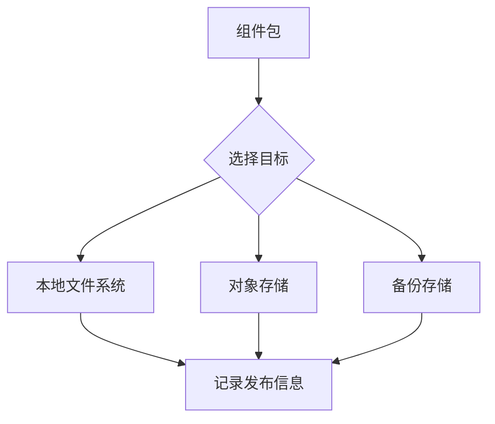
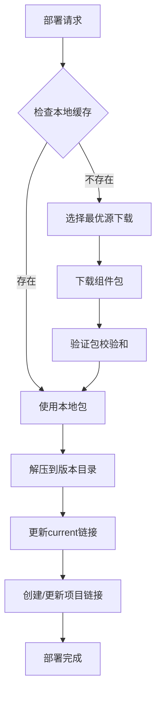

# 发布和部署设计方案

## 1. 概述

本文档描述了部署工具的完整设计方案，涵盖从代码打包到生产部署的全流程。设计目标是为机器学习和算法项目提供一个可靠、灵活、易用的部署解决方案。

### 1.1 核心问题

在机器学习项目部署中，我们面临以下挑战：

1. **版本管理复杂**：模型、配置、运行环境需要独立版本控制
2. **路径依赖问题**：程序依赖特定的目录结构和相对路径
3. **多环境部署**：需要在开发、测试、生产等多个环境部署
4. **快速回滚需求**：生产问题需要秒级回滚能力
5. **存储多样性**：需要支持本地文件系统、对象存储等多种方式

### 1.2 解决方案概览

我们采用组件化的设计思路，将项目拆分为独立的组件（如模型、配置、运行时），每个组件独立管理其生命周期。

## 2. 设计原则

### 2.1 组件独立原则

**设计决策**：每个组件拥有独立的版本号和生命周期。

**原因说明**：
- 模型更新频率远高于配置和运行环境
- 独立版本控制可以最小化更新影响范围
- 便于追踪和审计每个组件的变更历史

### 2.2 路径一致性原则

**设计决策**：打包时的相对路径结构在部署后必须完全保持。

**原因说明**：
- 许多ML框架依赖固定的相对路径查找资源文件
- 避免因路径变化导致的运行时错误
- 简化开发到生产的迁移过程

### 2.3 零停机部署原则

**设计决策**：通过软链接机制实现版本切换。

**原因说明**：
- 软链接切换是原子操作，避免中间状态
- 新版本部署不影响当前运行版本
- 支持秒级回滚，降低故障恢复时间

### 2.4 最小权限原则

**设计决策**：部署过程不要求root权限，支持用户级部署。

**原因说明**：
- 提高安全性，减少权限相关的风险
- 便于在受限环境（如容器）中使用
- 简化部署流程，无需频繁提权

## 3. 打包设计

### 3.1 设计理念

**简化优先原则**：当前阶段，我们选择最简单直接的打包方式。

**原因说明**：
- 机器学习模型文件通常很大，扫描所有文件会显著增加打包时间
- 大多数部署场景下，包级别的完整性验证已经足够
- 简化的设计降低了实现复杂度和维护成本
- 为未来需求预留了扩展空间，可以渐进式增强

### 3.2 打包流程


### 3.3 目录结构保持

**示例场景**：
```
项目结构：
/home/user/myproject/
├── models/
│   ├── bert/
│   │   ├── config.json
│   │   └── pytorch_model.bin
│   └── tokenizer/
│       └── vocab.txt
```

**打包命令**：
```bash
cd /home/user/myproject
deploy-tool pack ./models --type model --version 1.0.0
```

**压缩包内部结构**：
```
model-1.0.0.tar.gz
├── bert/
│   ├── config.json
│   └── pytorch_model.bin
└── tokenizer/
    └── vocab.txt
```

**设计说明**：
- 压缩包内保持 `models/` 目录下的相对结构
- 不包含 `models/` 本身，因为部署时会创建对应的组件目录
- 这样设计确保了代码中 `./bert/config.json` 这样的相对路径在部署后仍然有效
- 打包过程不扫描目录内容，提高打包速度，特别是对于包含大量文件的模型目录
- 信任用户指定的源目录内容，简化实现复杂度

### 3.4 清单文件设计

**清单示例**：
```json
{
  "component": {
    "type": "model",
    "version": "1.0.0",
    "created_at": "2024-01-20T10:00:00Z"
  },
  "package": {
    "file": "model-1.0.0.tar.gz",
    "size": 524288000,
    "algorithm": "gzip",
    "checksum": {
      "algorithm": "sha256",
      "value": "a665a45920422f9d417e4867efdc4fb8a04a1f3fff1fa07e998e86f7f7a27ae3"
    }
  },
  "metadata": {
    "source_path": "./models",
    "pack_version": "1.0"
  }
}
```

**设计说明**：
- 只记录整个压缩包的校验和，用于传输完整性验证
- 不扫描目录内部结构，打包效率更高
- metadata 字段预留扩展空间，未来可添加更多信息
- 保持设计的简洁性，避免过度工程

## 4. 发布设计

### 4.1 多目标发布

**设计决策**：支持同时发布到多个存储目标。

**原因说明**：
- 本地存储用于快速测试
- 对象存储用于跨地域分发
- 多副本提高可用性

**发布流程**：


### 4.2 发布记录设计

**记录示例**：
```json
{
  "component": {
    "type": "model",
    "version": "1.0.0"
  },
  "locations": [
    {
      "name": "local",
      "type": "filesystem",
      "path": "/data/packages/model/1.0.0/",
      "url": "file:///data/packages/model/1.0.0/model-1.0.0.tar.gz"
    },
    {
      "name": "production-bos",
      "type": "bos",
      "endpoint": "bj.bcebos.com",
      "bucket": "ml-artifacts",
      "object_key": "model/1.0.0/model-1.0.0.tar.gz"
    }
  ],
  "published_at": "2024-01-20T10:30:00Z"
}
```

**设计说明**：
- 每个位置记录访问所需的基本信息
- 文件系统类型保留URL格式便于统一处理
- BOS等对象存储记录endpoint、bucket和object_key
- **安全性考虑**：认证信息（如AK/SK）绝不记录在发布记录中，而是通过环境变量或配置文件单独管理，避免敏感信息泄露到Git仓库
- 支持后续添加新的发布位置

## 5. 部署设计

### 5.1 目录结构设计

```
/opt/deployments/                    # 部署根目录
├── components/                      # 组件存储目录
│   ├── model/                       # 模型组件目录
│   │   ├── 1.0.0/                  # 版本目录
│   │   │   ├── bert/               # 保持原始结构
│   │   │   │   ├── config.json
│   │   │   │   └── pytorch_model.bin
│   │   │   └── tokenizer/
│   │   │       └── vocab.txt
│   │   ├── 1.0.1/                  # 另一个版本
│   │   └── current -> 1.0.1/       # 当前版本链接
│   ├── config/                      # 配置组件目录
│   │   ├── 1.0.0/
│   │   └── current -> 1.0.0/
│   └── runtime/                     # 运行时组件目录
│       ├── 3.10.12/
│       └── current -> 3.10.12/
└── links/                           # 应用访问入口
    ├── model -> ../components/model/current/
    ├── config -> ../components/config/current/
    └── runtime -> ../components/runtime/current/
```

**设计说明**：

1. **为什么要有 components 目录**：
   - 集中管理所有组件，便于权限控制和备份
   - 清晰的层级结构，易于理解和维护

2. **为什么每个组件下有 current 链接**：
   - 组件级别的版本控制，切换版本只需更新一个链接
   - 保持向后兼容，旧版本仍然可访问

3. **为什么要有 links 目录**：
   - 为应用提供稳定的访问路径
   - 解耦组件存储位置和应用访问路径
   - 便于自定义额外的链接

### 5.2 部署流程设计



**流程说明**：

1. **优先使用本地缓存**：减少网络传输，提高部署速度
2. **智能源选择**：根据网络状况选择最快的下载源
3. **包级别验证**：只验证整个压缩包的完整性，不深入文件级别
4. **快速部署**：简化的流程确保部署速度
5. **原子性链接更新**：避免更新过程中的服务中断

### 5.3 软链接管理

**链接更新策略**：

采用原子性更新方式，确保链接切换过程中不会出现中间状态。具体做法是先创建指向新版本的临时链接，然后通过原子性的移动操作替换原有链接。这种方式避免了服务访问时遇到链接不存在的情况。

**切换时的注意事项**：

软链接切换本身是原子操作，但需要注意以下潜在影响：

1. **已打开文件的处理**：
   - 已经打开的文件句柄会继续指向旧版本的文件，不会立即受到影响
   - 但程序后续打开的文件会使用新版本
   - 这可能导致新旧版本混用的情况

2. **最佳实践建议**：
   - 在切换版本前，建议重启使用该组件的服务
   - 或确保服务有能力处理版本切换（如支持热重载）
   - 对于长时间运行的进程，需要特别注意文件句柄的管理

3. **风险提示**：
   - 某些应用可能缓存文件路径或动态加载模块
   - 数据文件格式不兼容可能导致运行时错误
   - 建议在低峰期进行版本切换，并做好监控

**自定义链接支持**：
```yaml
# 部署配置
deploy:
  custom_links:
    # 应用期望的路径 -> 实际部署路径
    /app/models: /opt/deployments/links/model
    /app/configs: /opt/deployments/links/config
```

**设计说明**：
- 原子操作保证高可用性
- 支持应用的特殊路径需求
- 所有链接集中管理，便于troubleshooting

## 6. 版本管理

### 6.1 版本切换机制

**切换流程**：


**设计说明**：
- 切换前保存当前状态，支持快速回滚
- 建议在切换前检查相关服务状态
- 验证步骤确保切换成功
- 日志记录便于审计和问题排查

**切换注意事项**：
- 版本切换不会影响已经打开的文件句柄，但新的文件访问会使用新版本
- 建议配合服务重启或热重载机制，确保完全切换到新版本
- 对于关键服务，建议采用灰度切换策略

### 6.2 版本清理策略

**保留策略选项**：
1. **保留最新N个版本**：适合快速迭代的环境
2. **保留特定时间内的版本**：如保留30天内的版本
3. **保留标记版本**：生产验证过的版本永久保留

**清理安全检查**：

在清理版本之前，系统会进行多项安全检查：
- 不能清理当前正在使用的版本
- 不能清理被其他组件依赖的版本
- 不能清理被标记为永久保留的版本

只有通过所有安全检查的版本才会被清理，这样可以避免误删重要版本导致的服务中断。

## 7. 命令设计

### 7.1 命令体系结构

部署工具提供了结构化的命令体系：

- **pack**：打包命令，用于创建组件压缩包
- **publish**：发布命令，将组件包上传到存储目标
- **deploy**：部署命令，在目标环境安装组件
- **version**：版本管理命令组
  - list：列出某个组件的所有版本
  - switch：切换组件到指定版本
  - cleanup：清理不再需要的旧版本
- **links**：链接管理命令组
  - list：显示所有软链接及其状态
  - verify：验证链接的有效性
  - repair：修复损坏的链接

**设计说明**：
- 命令按功能分组，逻辑清晰
- 子命令提供更细粒度的控制
- 命令名称直观，易于记忆

### 7.2 典型使用流程

**场景1：首次部署**

开发环境需要依次打包所有组件，指定组件类型和版本号。然后将打包好的组件发布到配置的存储目标。在生产环境，按需部署各个组件，系统会自动创建相应的目录结构和软链接。

**场景2：模型更新**

当模型需要更新时，只需打包新版本的模型组件，发布后在生产环境部署这个新版本。其他组件（如配置和运行时）保持不变，实现了最小化更新。

**场景3：紧急回滚**

如果新部署的模型出现问题，可以快速切换回之前的版本。切换操作只是更新软链接，几乎瞬间完成，最大程度减少了服务中断时间。

## 8. 配置规范

### 9.1 项目配置文件

项目配置文件（.deploy-tool.yaml）是整个部署系统的核心配置，包含以下主要部分：

**基本信息配置**：
- 配置版本号，确保向后兼容
- 项目名称、类型和描述信息
- 项目根目录路径（支持环境变量）

**组件定义**：
- 定义项目包含的所有组件类型
- 每个组件指定源目录路径
- 组件的描述信息，便于理解用途

**打包配置**：
- 定义默认的排除规则，如Python缓存文件、Git目录等
- 压缩算法选择（gzip、bzip2、xz、lz4）
- 压缩级别设置，平衡压缩率和速度

**发布配置**：
- 配置多个发布目标，如本地文件系统、对象存储等
- 每个目标包含类型、访问凭证等信息
- 支持环境变量引用，避免敏感信息硬编码

**部署配置**：
- 部署根目录，所有组件将安装在此目录下
- 下载源优先级，系统据此选择最优下载源
- 软链接配置，包括自定义链接映射

**配置设计原则**：
1. **环境变量支持**：所有敏感信息和环境相关配置都支持环境变量
2. **灵活路径配置**：支持相对路径和绝对路径，适应不同场景
3. **可扩展性**：易于添加新的组件类型和存储后端
4. **默认值合理**：大多数配置都有合理的默认值，降低配置复杂度

## 9. 错误处理和恢复

### 9.1 常见错误场景

1. **部署中断**：
   - 保留部分下载的文件供断点续传
   - 不会影响当前运行版本

2. **包校验和不匹配**：
   - 自动重试下载
   - 尝试其他下载源
   - 保留错误文件供调试

3. **权限问题**：
   - 提供清晰的错误信息
   - 建议正确的权限设置

4. **版本切换相关问题**：
   - **文件被占用**：某些系统可能因文件被占用而无法删除旧版本目录
   - **新旧版本混用**：已运行的进程可能继续使用旧版本文件
   - **缓存不一致**：应用可能缓存了旧版本的路径或内容
   - **解决方案**：提供服务重启指引，建议使用热重载机制

### 9.2 恢复机制

部署过程采用事务性设计，确保操作的原子性：

**事务执行流程**：
1. 在开始部署前，保存当前系统状态
2. 按顺序执行部署步骤：下载、验证、解压、更新链接
3. 每个步骤都记录可回滚的操作
4. 如果任何步骤失败，自动执行回滚操作
5. 回滚会恢复到部署前的状态，确保系统稳定性

这种设计确保了部署要么完全成功，要么完全回滚，不会留下不一致的中间状态。

## 10. 安全考虑

### 10.1 文件完整性

- 所有压缩包使用SHA256校验和验证
- 清单文件记录压缩包的校验和
- 下载后自动验证，不匹配则重试或报错
- 保留未来添加文件级别校验的扩展性

### 10.2 访问控制

- 支持基于角色的访问控制
- 敏感组件可以设置额外的访问限制
- 部署日志记录所有操作

### 10.3 传输安全

- 支持HTTPS/TLS加密传输
- 对象存储使用签名URL
- 本地存储注意文件权限设置

## 11. 性能优化

### 11.1 并行处理

- 多文件并行压缩/解压
- 多目标并行发布
- 大文件分块传输

### 11.2 缓存机制

- 本地包缓存避免重复下载
- 解压缓存加速重复部署
- 元数据缓存减少文件系统访问

### 11.3 未来优化方向

- 支持差分包（需要文件级别扫描）
- 增量更新机制（基于文件变更检测）
- 智能压缩策略（根据文件类型选择算法）

## 12. 监控和可观测性

### 12.1 日志设计

```
2024-01-20 10:00:00 [INFO] 开始部署 component=model version=1.0.1
2024-01-20 10:00:01 [INFO] 从 local 下载包文件
2024-01-20 10:00:30 [INFO] 下载完成 size=524MB duration=29s
2024-01-20 10:00:31 [INFO] 解压文件到 /opt/deployments/components/model/1.0.1
2024-01-20 10:01:00 [INFO] 更新链接 current -> 1.0.1
2024-01-20 10:01:01 [INFO] 部署成功 component=model version=1.0.1
```

### 12.2 指标采集

- 部署耗时
- 下载速度
- 存储使用率
- 版本分布

### 12.3 健康检查

系统提供健康检查功能，可以快速诊断部署环境的状态。检查项目包括：

- 部署目录的读写权限
- 所有组件软链接的有效性
- 存储空间是否充足
- 是否有可清理的旧版本
- 配置文件的有效性
- 包缓存目录的状态

健康检查能够帮助运维人员快速发现和定位问题，保证部署系统的稳定运行。

## 13. 总结

本方案通过组件化设计、软链接机制、多存储支持等核心特性，为机器学习项目提供了一个简单、可靠、高效的部署解决方案。设计遵循简化优先的原则，在满足核心需求的同时保持了系统的简洁性：

- **打包简化**：不扫描目录内容，直接压缩，提高效率
- **验证适度**：只做包级别的完整性验证，平衡安全与性能
- **扩展性好**：预留了元数据字段，可根据未来需求渐进式增强
- **运维友好**：充分考虑了版本切换时的各种场景，提供了详细的注意事项

在实际使用中，需要特别注意版本切换对运行中服务的影响，建议结合服务管理策略（如优雅重启、热重载）来确保平滑过渡。每个设计决策都基于实际需求，避免过度工程，确保系统能够快速落地并稳定运行。